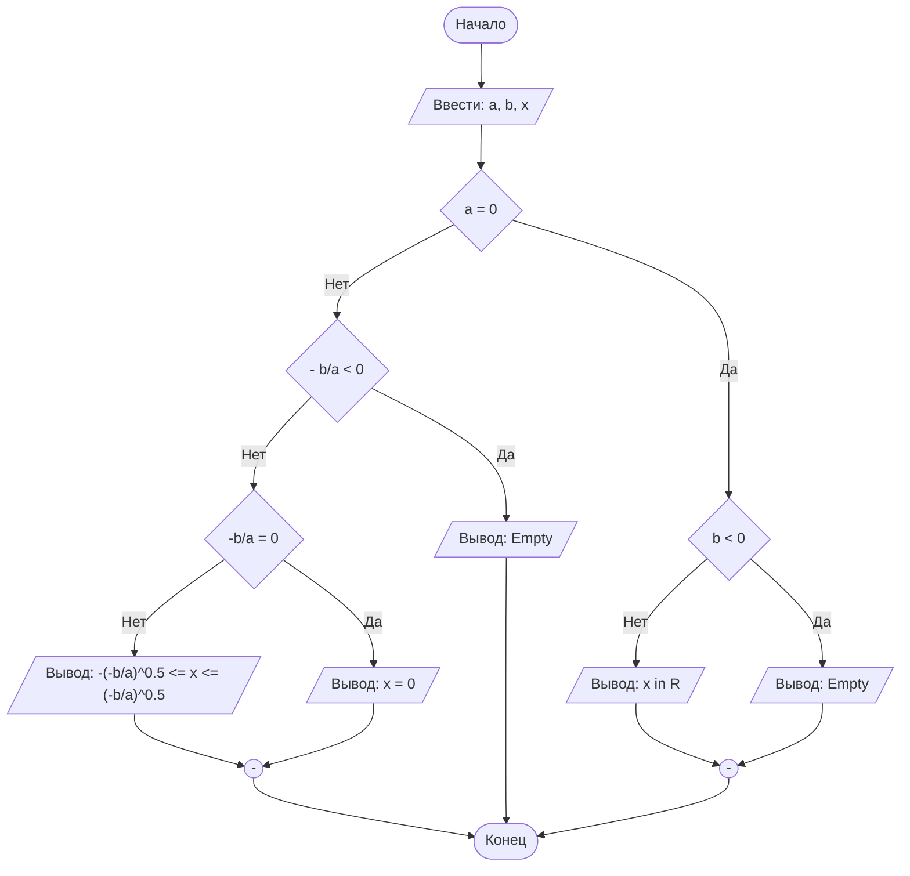

# Lab1

```mermaid
graph TD
    A([Начало]) --> B[/Ввести: a, b, x/]
    B --> C{a = 0}
    C -- Нет --> D{- b/a < 0}
    D -- Нет --> E{"-b/a = 0"}
    E -- Нет --> F[/"Вывод: -(-b/a)^0.5 <= x <= (-b/a)^0.5"/]
    E -- Да --> G[/Вывод: x = 0/]
    D -- Да --> H[/Вывод: Empty/]
    C -- Да --> I{b < 0}
    I -- Нет --> J[/Вывод: x in R/]
    I -- Да --> K[/Вывод: Empty/]
    J --> M(("-"))
    K --> M
    G --> L(("-"))
    H ----> Z
    F --> L
    M --> Z
    L --> Z([Конец])

```
