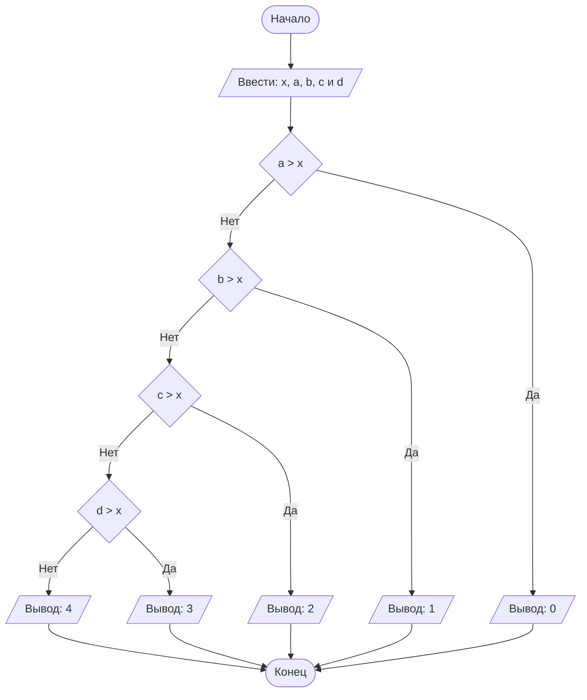

# Lab1
## Отчет по лабораторной работе № 1

#### № группы: `ПМ-2401`

#### Выполнила: `Ершова Алина Дмитриевна`

#### Вариант: `13`

### Cодержание:

- [Постановка задачи](#1-постановка-задачи)
- [Входные и выходные данные](#2-входные-и-выходные-данные)
- [Выбор структуры данных](#3-выбор-структуры-данных)
- [Алгоритм](#4-алгоритм)
- [Программа](#5-программа)
- [Анализ правильности решения](#6-анализ-правильности-решения)

### 1. Постановка задачи
>Набор бусинок диаметрами A, B, C, D, надетый на нить, пытаются протащить в указанном порядке через отверстие диаметром X. Какое количество бусинок удастся протащить через отверстие? На вход программы подаются натуральные числа X, A, B, C, D. 

В данной задачи от меня требуют вывести количество бусинок, которые можно протащить через отверстие указанного диаметра. Т. е. если у первой бусинки диаметр больше, чем диаметр отверстия, то мы не сожем протащить ни одной бусинки. Если первая бусинка имеет диаметр меньший или равный диаметру отверстия, то у нас получится протащить эту бусинку. И так далее, проверяем условия для последующих бусинок (если диаметр бусинки > диаметра отверстия, выводим кол-во бусинок, которые протащили до этого, если же диаметр бусинки не больше, проверяем условие для следующей бусинки).

### 2. Входные и выходные данные
#### Данные на вход
В условии сказано, что на вход поступают натуральные числа X, A, B, C, D. Минимальное значение натурального числа это 1, а максимальное не ограниченно(в java максимальное - 2<sup>63</sup>-1)

|	          |Тип	             | min значение |   max значение  |
|-----------|------------------|--------------|-----------------|
|X (Число 1)|	Натуральное число|	1           |	2<sup>63</sup>-1|
|A (Число 2)|	Натуральное число|	1           |	2<sup>63</sup>-1|
|B (Число 3)|	Натуральное число|	1           |	2<sup>63</sup>-1|
|C (Число 4)|	Натуральное число|	1           |	2<sup>63</sup>-1|
|D (Число 5)|	Натуральное число|	1           |	2<sup>63</sup>-1|

#### Данные на выход
Требуется вывести количетсво бусинок. Будет выведено целое число от 0 до 4, т.к. всего четыре бусинки (можем протащить и все 4 бусинки, и ни одной).

|         | Тип                             | min значение | max значение   |
|---------|---------------------------------|--------------|----------------|
| Число 1 | Целое неотрицательное число     | 0            | 4              |

### 3. Выбор структуры данных

Программа получает 5 натуральных чисел. Поэтому для хранения выделю 5 переменных (`x`,`a`,`b`,`c` и `d`) типа `integer`.


|	          |название переменной|	Тип (в Java)|
|-----------|-------------------|-------------|
|X (Число 1)|	x	                |integer      |
|A (Число 2)|	a	                |integer      |
|B (Число 3)|	b                	|integer      |
|C (Число 4)|	c                	|integer      |
|D (Число 5)|	d	                |integer      |

Для вывода результата необязательно его хранить в отдельной переменной.

### 4. Алгоритм

#### Алгоритм выполнения программы:
1. **Ввод данных**
Программа считывает пять натуральных чисел, обозначенных как x,a,b,c и d

2. **“Защита от дурака”** 
Если введено хотя бы одно ненатуральное число, вывести “Введены не натуральные числа”

3. **Сравнение чисел и вывод результата**
Поочереди сравниваем числа с `x`, начиная с `а`:

-Если `а` больше `х`, выводим 0, т.к. не удастся протащить ни одну бусинку. 

Если `а` не больше, то сравниваем `х` с `b`. 

-Если `b` больше `х`, выводим 1, т.к. удастся протащить одну бусинку(`а`), но не удастся протащить `b` и последующие.

Если `b` не больше, сравниваем с `c`. 

-Если `c` больше `х`, выводим 2, т.к. удастся протащить только 2 бусинки (`a` и `b`), но не удастся протащить `c` и `d`.

Если `c` не больше, сравниваем `х` с `d`. 

-Если `d` больше `х` выводим 3, т.к. удастся протащить три предыдущие бусинки, но не удастся протащить последнюю

Иначе выводим 4, т.к. получилось перетащить все бусинки.

#### Блок-схема



### 5. Программа
```java
import java.io.PrintStream;
import java.util.Scanner;
public class Main {
    public static Scanner in = new Scanner(System.in);
    public static PrintStream out = System.out;
    public static void main(String[] args) {
        //считывание пяти переменных x,a,b,c и d из консоли
        int x = in.nextInt();
        int a = in.nextInt();
        int b = in.nextInt();
        int c = in.nextInt();
        int d = in.nextInt();
        if (x<1 || a<1 || b<1 || c<1 || d<1) //"Защита от дурака"
            out.print("Введены не натуральные числа");
        else{
            if (a>x) //если а больше х, выводим 0 т.к. а не пролезла и следующие бусинки тоже не пролезут
                out.print(0);
            else{ //если а не больше х, то у нас получилось перетащить первую бусинку
                //переходим к следующей бусинке
                if (b>x) //если b больше х выводим 1
                    //т.к. пролезла только первая бусинка а, но не пролезет бусинка b и последующие
                    out.print(1);
                else{// если b не больше х, то у нас получится перетащить и эту бусинку
                    //уже перетащили 2 бусинки (а и b)
                    //переходим к следующей бусинке
                    if (c>x) //если с больше х выводим 2
                        //т.к. пролезли бусинки a и b, но не пролезет бусинка с и d
                        out.print(2);
                    else{// если с не больше х, то у нас получится перетащить и эту бусинку
                        //уже перетащили 3 бусинки (а, b и c)
                        // переходим к последней бусинке
                        if (d>x) //если d больше х, выводим 3,
                            //т.к. смогли перетащить три предыдущие бусинки, но не смогли перетащить d
                            out.print(3);
                        else //если d не больше х, то выводим 4.
                            //т.к. мы смогли перетащить все бусинки
                            out.print(4);
                    }
                }
            }
        }
    }
}
```

### 6. Анализ правильности решения

1) Тест на A>X

- **Input**:
        ```
        7 8 4 15 6
        ```
- **Output**:
        ```
        0
        ```
  
2) Тест на A<=X<B

- **Input**:
        ```
        10 8 11 3 4
        ```
- **Output**:
        ```
        1
        ```
  
3) Тест на A,B <= X < C 

- **Input**:
        ```
        10 8 10 15 6
        ```
- **Output**:
        ```
        2
        ```
  
4) Тест на A,B,C <= X < D

- **Input**:
        ```
        10 8 4 6 15
        ```
- **Output**:
        ```
        3
        ```
  
5) Тест на X >= A,B,C,D

- **Input**:
        ```
        15 6 7 8 9
        ```
- **Output**:
        ```
        4
        ```
  
6) Тест на дурака: X<1 или A<1 или B<1 или C<1 или D<1
   
- **Input**:
        ```
        5 -4 6 5 4
        ```
- **Output**:
        ```
        Введены не натуральные числа
        ```
